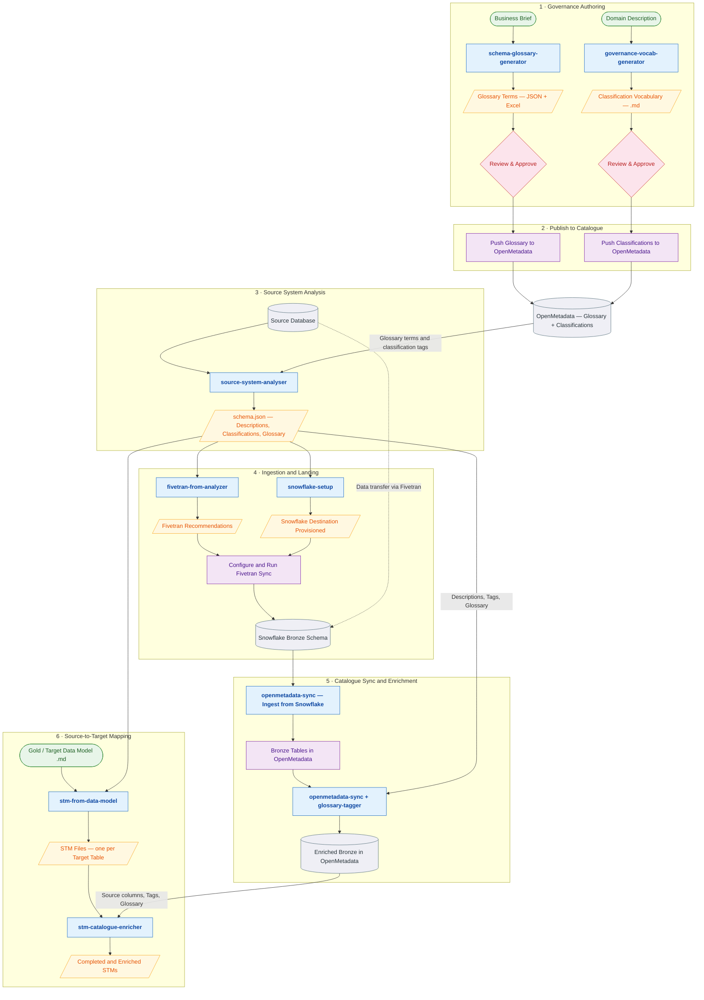

# End-to-End Data Platform Flow

## Step Descriptions

### 1 -- Governance Authoring

Two parallel tracks that produce the business vocabulary before any technical work begins.

- **Glossary track:** A business brief (plain-language description of the domain) is fed to the `schema-glossary-generator` skill, which authors glossary terms -- business concepts like Customer, Product, Invoice, Payment. Output is a JSON + Excel workbook. A human reviews and approves the terms before they go further.
- **Classification track:** A domain description is fed to the `governance-vocab-generator` skill, which produces a classification vocabulary -- governance dimensions like PII, Criticality, Lifecycle, Architecture tier. Output is a structured Markdown file. A human reviews and approves these too.

### 2 -- Publish to Catalogue

Approved glossary terms and classification tags are pushed into OpenMetadata via the `openmetadata-sync` skill and its MCP tools. After this step, OpenMetadata holds the authoritative business vocabulary that downstream steps can reference.

### 3 -- Source System Analysis

The `source-system-analyser` skill connects directly to the legacy source database. It profiles the schema, generates descriptions, and -- crucially -- pulls the approved glossary terms and classification tags from OpenMetadata to map them onto the tables and columns it discovers. The output is `schema.json`: a single normalized contract containing table/column metadata, descriptions, data quality findings, classification tag assignments, and glossary term assignments.

### 4 -- Ingestion and Landing

Two skills work from `schema.json`:

- **`snowflake-setup`** provisions the Snowflake destination objects (user, role, warehouse, database, bronze schema).
- **`fivetran-from-analyzer`** produces a detailed Fivetran recommendation report (connector type, sync modes, hashing, scheduling, a full parameter checklist).

Once Fivetran is configured and the sync runs, the legacy source data lands in the Snowflake bronze schema.

### 5 -- Catalogue Sync and Enrichment

Now that bronze tables exist in Snowflake:

1. **`openmetadata-sync`** creates a Snowflake ingestion pipeline in OpenMetadata and runs it, pulling the bronze table/column structures into the catalogue.
2. **`openmetadata-sync` + `openmetadata-glossary-tagger`** then apply the descriptions, classification tags, and glossary term assignments from `schema.json` back onto those bronze tables/columns in OpenMetadata.

After this step, the bronze schema in OpenMetadata is fully enriched with business context.

### 6 -- Source-to-Target Mapping

A target data model (e.g., a gold-layer dimensional/star-schema written in Markdown) is provided as input:

1. **`stm-from-data-model`** generates one STM (source-to-target mapping) Markdown document per target table, using the data model plus `schema.json` for classification tags and glossary terms.
2. **`stm-catalogue-enricher`** then queries the enriched bronze catalogue in OpenMetadata to fill in the source-side columns, data types, and transformation notes that the initial generation could not determine on its own.

The final output is a complete set of STM documents ready for implementation review.

## Legend

| Colour | Meaning |
|--------|---------|
| Green | External input (business brief, domain description, data model) |
| Blue | Cursor skill |
| Yellow | Generated artifact (JSON, Excel, Markdown) |
| Pink | Human review / approval gate |
| Purple | Orchestration action |
| Grey | Persistent store (database, catalogue) |
