# Consulting Practice Financials Data Model

**Generated**: 2026-03-25
**Framework**: Dimensional (Star Schema)
**Naming Convention**: PascalCase

## Summary

This dimensional model supports analytics for a consulting practice focusing on project financials. The model captures three core business processes:

1. **Time Entry Tracking** - Records consultant hours at the consultant/day/project grain, enabling analysis of utilization, billable vs. non-billable time, and resource allocation
2. **Project Expense Management** - Tracks all project-related expenses with full categorization for cost control and client billing
3. **Project Financial Health** - Monthly snapshots providing cumulative financial metrics for project performance monitoring

### Key Design Decisions

- **Grain for Time Entry**: One row per consultant per day per project, allowing roll-up by any dimension while maintaining the detail needed for accurate billing
- **Separate Expense Fact**: Project expenses modeled independently from time to support different grains and detailed expense analysis
- **Project Snapshot Fact**: Monthly snapshots capture cumulative financials, enabling trend analysis and variance reporting
- **Conformed Dimensions**: DimDate, DimConsultant, and DimProject are shared across all fact tables for consistent cross-process analysis
- **Role-Playing Date Dimension**: Date dimension serves multiple roles (entry date, expense date, snapshot date, project dates)
- **Client Hierarchy**: DimProject includes client reference enabling analysis by client without snowflaking

---

## Table Catalog

### DimDate

**Type**: Dimension (Conformed, Role-Playing)
**Description**: Standard calendar dimension supporting time-based analysis across all fact tables. Used as role-playing dimension for various date contexts (time entry date, expense date, snapshot date, project start/end dates).

| Column | Data Type | Nullable | Description |
|--------|-----------|----------|-------------|
| DateHashPK | INT | NO | Surrogate primary key for date dimension |
| DateValue | DATE | NO | Actual calendar date value |
| DateKey | INT | NO | Natural key in YYYYMMDD format |
| DayOfWeek | INT | NO | Day of week number (1=Sunday, 7=Saturday) |
| DayName | VARCHAR(10) | NO | Full name of day (Monday, Tuesday, etc.) |
| DayOfMonth | INT | NO | Day number within the month (1-31) |
| DayOfYear | INT | NO | Day number within the year (1-366) |
| WeekOfYear | INT | NO | ISO week number (1-53) |
| MonthNumber | INT | NO | Month number (1-12) |
| MonthName | VARCHAR(10) | NO | Full name of month (January, February, etc.) |
| MonthShortName | VARCHAR(3) | NO | Abbreviated month name (Jan, Feb, etc.) |
| QuarterNumber | INT | NO | Quarter number (1-4) |
| QuarterName | VARCHAR(2) | NO | Quarter label (Q1, Q2, Q3, Q4) |
| CalendarYear | INT | NO | Four-digit calendar year |
| FiscalMonth | INT | NO | Fiscal month number based on fiscal calendar |
| FiscalQuarter | INT | NO | Fiscal quarter number |
| FiscalYear | INT | NO | Fiscal year number |
| IsWeekend | BOOLEAN | NO | Flag indicating Saturday or Sunday |
| IsHoliday | BOOLEAN | NO | Flag indicating company holiday |
| IsWorkingDay | BOOLEAN | NO | Flag indicating regular working day |

**Primary Key**: DateHashPK
**Business Key**: DateKey (YYYYMMDD format)
**Business Rules**: Date range typically covers 5 years historical + 2 years future

---

### DimConsultant

**Type**: Dimension (Conformed, SCD Type 2)
**Description**: Employee/consultant master dimension containing professional details, organizational hierarchy, and employment attributes. Supports historical tracking via SCD Type 2 for changes in title, department, or rate.

| Column | Data Type | Nullable | Description |
|--------|-----------|----------|-------------|
| ConsultantHashPK | INT | NO | Surrogate primary key for consultant dimension |
| ConsultantHashBK | VARCHAR(20) | NO | Business key (employee ID from HR system) |
| FirstName | VARCHAR(50) | NO | Consultant first name |
| LastName | VARCHAR(50) | NO | Consultant last name |
| FullName | VARCHAR(100) | NO | Computed full name (FirstName + LastName) |
| Email | VARCHAR(100) | NO | Corporate email address |
| Title | VARCHAR(100) | NO | Current job title |
| Level | VARCHAR(50) | NO | Consultant level (Analyst, Consultant, Senior, Manager, Director, Partner) |
| Department | VARCHAR(50) | NO | Department or practice area |
| PracticeArea | VARCHAR(50) | NO | Specialty practice area |
| OfficeLocation | VARCHAR(50) | NO | Primary office location |
| HireDate | DATE | NO | Original hire date |
| TerminationDate | DATE | YES | Termination date if applicable |
| StandardBillRate | DECIMAL(10,2) | NO | Standard hourly billing rate |
| StandardCostRate | DECIMAL(10,2) | NO | Standard hourly cost rate |
| TargetUtilization | DECIMAL(5,4) | NO | Target utilization percentage (0.75 = 75%) |
| IsActive | BOOLEAN | NO | Flag indicating active employment status |
| EffectiveDate | DATE | NO | SCD Type 2 row effective start date |
| ExpirationDate | DATE | NO | SCD Type 2 row expiration date |
| IsCurrent | BOOLEAN | NO | SCD Type 2 current row flag |

**Primary Key**: ConsultantHashPK
**Business Key**: ConsultantHashBK
**SCD Type**: Type 2 on Title, Level, Department, StandardBillRate, StandardCostRate
**Business Rules**:
- Level valid values: Analyst, Consultant, Senior Consultant, Manager, Senior Manager, Director, Partner
- TargetUtilization typically ranges from 0.60 to 0.90

---

### DimClient

**Type**: Dimension (SCD Type 2)
**Description**: Client organization master containing company details, industry classification, and relationship attributes. Supports historical tracking for changes in account status or industry classification.

| Column | Data Type | Nullable | Description |
|--------|-----------|----------|-------------|
| ClientHashPK | INT | NO | Surrogate primary key for client dimension |
| ClientHashBK | VARCHAR(20) | NO | Business key (client ID from CRM system) |
| ClientName | VARCHAR(100) | NO | Legal company name |
| ClientShortName | VARCHAR(50) | NO | Common/short name for reporting |
| Industry | VARCHAR(50) | NO | Primary industry classification |
| IndustrySector | VARCHAR(50) | NO | Industry sector grouping |
| CompanySize | VARCHAR(20) | NO | Size classification (Small, Medium, Large, Enterprise) |
| AccountStatus | VARCHAR(20) | NO | Account status (Prospect, Active, Inactive, Former) |
| AccountManager | VARCHAR(100) | NO | Assigned account manager name |
| BillingAddress | VARCHAR(200) | YES | Client billing address |
| BillingCity | VARCHAR(50) | YES | Billing city |
| BillingState | VARCHAR(50) | YES | Billing state/province |
| BillingCountry | VARCHAR(50) | YES | Billing country |
| PaymentTerms | VARCHAR(20) | NO | Standard payment terms (Net 30, Net 45, etc.) |
| RelationshipStartDate | DATE | NO | Date client relationship began |
| EffectiveDate | DATE | NO | SCD Type 2 row effective start date |
| ExpirationDate | DATE | NO | SCD Type 2 row expiration date |
| IsCurrent | BOOLEAN | NO | SCD Type 2 current row flag |

**Primary Key**: ClientHashPK
**Business Key**: ClientHashBK
**SCD Type**: Type 2 on AccountStatus, Industry, AccountManager
**Business Rules**:
- AccountStatus valid values: Prospect, Active, Inactive, Former
- CompanySize valid values: Small (<100 employees), Medium (100-999), Large (1000-9999), Enterprise (10000+)

---

### DimProject

**Type**: Dimension (SCD Type 2)
**Description**: Project master dimension containing engagement details, financials, and status information. Links to client dimension. Supports historical tracking for changes in status, budget, or project manager.

| Column | Data Type | Nullable | Description |
|--------|-----------|----------|-------------|
| ProjectHashPK | INT | NO | Surrogate primary key for project dimension |
| ProjectHashBK | VARCHAR(20) | NO | Business key (project code from PM system) |
| ClientHashFK | INT | NO | Foreign key to client dimension |
| ProjectName | VARCHAR(100) | NO | Project display name |
| ProjectCode | VARCHAR(20) | NO | Internal project code |
| ProjectType | VARCHAR(50) | NO | Type of engagement |
| ProjectStatus | VARCHAR(20) | NO | Current project status |
| ProjectManager | VARCHAR(100) | NO | Assigned project manager name |
| EngagementPartner | VARCHAR(100) | NO | Partner responsible for engagement |
| ServiceLine | VARCHAR(50) | NO | Service line classification |
| StartDate | DATE | NO | Project start date |
| PlannedEndDate | DATE | YES | Originally planned end date |
| ActualEndDate | DATE | YES | Actual completion date |
| ContractType | VARCHAR(30) | NO | Contract billing type |
| ContractValue | DECIMAL(15,2) | YES | Total contract value (for fixed-price) |
| BudgetHours | DECIMAL(10,2) | YES | Budgeted hours for project |
| BudgetAmount | DECIMAL(15,2) | YES | Total budget amount |
| IsActive | BOOLEAN | NO | Flag indicating active project status |
| EffectiveDate | DATE | NO | SCD Type 2 row effective start date |
| ExpirationDate | DATE | NO | SCD Type 2 row expiration date |
| IsCurrent | BOOLEAN | NO | SCD Type 2 current row flag |

**Primary Key**: ProjectHashPK
**Foreign Keys**: ClientHashFK -> DimClient.ClientHashPK
**Business Key**: ProjectHashBK
**SCD Type**: Type 2 on ProjectStatus, ProjectManager, BudgetHours, BudgetAmount
**Business Rules**:
- ProjectType valid values: Strategy, Implementation, Assessment, Training, Support, Advisory
- ProjectStatus valid values: Proposed, Active, On Hold, Completed, Cancelled
- ContractType valid values: Time and Materials, Fixed Price, Retainer, Milestone-Based

---

### DimExpenseCategory

**Type**: Dimension (SCD Type 1)
**Description**: Expense classification hierarchy for categorizing project expenses. Includes category and subcategory levels for roll-up analysis.

| Column | Data Type | Nullable | Description |
|--------|-----------|----------|-------------|
| ExpenseCategoryHashPK | INT | NO | Surrogate primary key for expense category |
| ExpenseCategoryHashBK | VARCHAR(20) | NO | Business key (expense code) |
| CategoryName | VARCHAR(50) | NO | Top-level expense category name |
| SubcategoryName | VARCHAR(50) | NO | Subcategory name |
| CategoryCode | VARCHAR(10) | NO | Category code for GL mapping |
| ExpenseDescription | VARCHAR(200) | YES | Detailed description of expense type |
| IsBillable | BOOLEAN | NO | Default billable flag for category |
| RequiresReceipt | BOOLEAN | NO | Flag indicating receipt requirement |
| RequiresApproval | BOOLEAN | NO | Flag indicating approval requirement |
| ApprovalThreshold | DECIMAL(10,2) | YES | Amount threshold requiring additional approval |
| GLAccountCode | VARCHAR(20) | NO | General ledger account mapping |
| IsActive | BOOLEAN | NO | Flag indicating active category |

**Primary Key**: ExpenseCategoryHashPK
**Business Key**: ExpenseCategoryHashBK
**Business Rules**:
- CategoryName valid values: Travel, Meals, Lodging, Transportation, Materials, Software, Professional Services, Other
- IsBillable defaults based on category but can be overridden at expense level

---

### DimBillingType

**Type**: Dimension (Junk Dimension)
**Description**: Billing classification dimension combining billable status, billing category, and overtime flags. Reduces fact table width by consolidating low-cardinality billing attributes.

| Column | Data Type | Nullable | Description |
|--------|-----------|----------|-------------|
| BillingTypeHashPK | INT | NO | Surrogate primary key for billing type |
| BillingTypeCode | VARCHAR(10) | NO | Natural key code for billing type |
| IsBillable | BOOLEAN | NO | Flag indicating time is billable to client |
| BillingCategory | VARCHAR(30) | NO | Category of work performed |
| IsOvertime | BOOLEAN | NO | Flag indicating overtime hours |
| BillingMultiplier | DECIMAL(5,2) | NO | Rate multiplier (1.0 = standard, 1.5 = overtime) |
| BillingDescription | VARCHAR(100) | NO | Description for billing display |

**Primary Key**: BillingTypeHashPK
**Business Key**: BillingTypeCode
**Business Rules**:
- BillingCategory valid values: Consulting, Development, Project Management, Training, Travel, Administrative, Business Development, Internal
- BillingMultiplier: 1.0 for standard, 1.5 for overtime, 0.0 for non-billable

---

### FactTimeEntry

**Type**: Fact (Transaction)
**Description**: Core time tracking fact table recording consultant hours worked. Grain is one row per consultant per day per project, allowing detailed utilization analysis and billing calculations.

| Column | Data Type | Nullable | Description |
|--------|-----------|----------|-------------|
| TimeEntryHashPK | INT | NO | Surrogate primary key for time entry fact |
| DateHashFK | INT | NO | Foreign key to date dimension (entry date) |
| ConsultantHashFK | INT | NO | Foreign key to consultant dimension |
| ProjectHashFK | INT | NO | Foreign key to project dimension |
| BillingTypeHashFK | INT | NO | Foreign key to billing type dimension |
| TimeEntryId | VARCHAR(30) | NO | Degenerate dimension - source system entry ID |
| HoursWorked | DECIMAL(5,2) | NO | Total hours worked for this entry |
| BillableHours | DECIMAL(5,2) | NO | Hours that are billable to client |
| NonBillableHours | DECIMAL(5,2) | NO | Hours that are not billable |
| BillRate | DECIMAL(10,2) | NO | Billing rate applied for this entry |
| CostRate | DECIMAL(10,2) | NO | Cost rate for this consultant |
| BilledAmount | DECIMAL(12,2) | NO | Calculated billable amount (BillableHours * BillRate) |
| CostAmount | DECIMAL(12,2) | NO | Calculated cost amount (HoursWorked * CostRate) |
| MarginAmount | DECIMAL(12,2) | NO | Calculated margin (BilledAmount - CostAmount) |
| LoadTimestamp | TIMESTAMP | NO | ETL load timestamp |
| EtlBatchId | INT | NO | ETL batch identifier |

**Primary Key**: TimeEntryHashPK
**Foreign Keys**:
- DateHashFK -> DimDate.DateHashPK
- ConsultantHashFK -> DimConsultant.ConsultantHashPK
- ProjectHashFK -> DimProject.ProjectHashPK
- BillingTypeHashFK -> DimBillingType.BillingTypeHashPK

**Grain**: One row per consultant per day per project
**Measures**:
- Additive: HoursWorked, BillableHours, NonBillableHours, BilledAmount, CostAmount, MarginAmount
- Non-Additive: BillRate, CostRate (use weighted average)

**Business Rules**:
- HoursWorked = BillableHours + NonBillableHours
- BilledAmount = BillableHours * BillRate
- CostAmount = HoursWorked * CostRate
- MarginAmount = BilledAmount - CostAmount

---

### FactProjectExpense

**Type**: Fact (Transaction)
**Description**: Project expense tracking fact table capturing all costs incurred for projects. Supports full expense lifecycle from submission through reimbursement and client billing.

| Column | Data Type | Nullable | Description |
|--------|-----------|----------|-------------|
| ProjectExpenseHashPK | INT | NO | Surrogate primary key for expense fact |
| ExpenseDateHashFK | INT | NO | Foreign key to date dimension (expense incurred date) |
| SubmissionDateHashFK | INT | NO | Foreign key to date dimension (expense submitted date) |
| ConsultantHashFK | INT | NO | Foreign key to consultant dimension (who incurred) |
| ProjectHashFK | INT | NO | Foreign key to project dimension |
| ExpenseCategoryHashFK | INT | NO | Foreign key to expense category dimension |
| ExpenseId | VARCHAR(30) | NO | Degenerate dimension - source system expense ID |
| ExpenseDescription | VARCHAR(500) | YES | Description of the expense |
| VendorName | VARCHAR(100) | YES | Vendor or merchant name |
| ExpenseAmount | DECIMAL(12,2) | NO | Total expense amount in original currency |
| CurrencyCode | VARCHAR(3) | NO | ISO currency code of expense |
| ExchangeRate | DECIMAL(10,6) | NO | Exchange rate to base currency |
| ExpenseAmountBase | DECIMAL(12,2) | NO | Expense amount in base currency |
| TaxAmount | DECIMAL(10,2) | NO | Tax portion of expense |
| IsBillable | BOOLEAN | NO | Flag indicating expense is billable to client |
| BillableAmount | DECIMAL(12,2) | NO | Amount to be billed to client |
| MarkupPercent | DECIMAL(5,4) | NO | Markup percentage applied (0.10 = 10%) |
| ReimbursementStatus | VARCHAR(20) | NO | Status of reimbursement to consultant |
| BillingStatus | VARCHAR(20) | NO | Status of billing to client |
| HasReceipt | BOOLEAN | NO | Flag indicating receipt is attached |
| ApprovalStatus | VARCHAR(20) | NO | Expense approval status |
| ApprovedBy | VARCHAR(100) | YES | Name of approver |
| ApprovalDate | DATE | YES | Date expense was approved |
| LoadTimestamp | TIMESTAMP | NO | ETL load timestamp |
| EtlBatchId | INT | NO | ETL batch identifier |

**Primary Key**: ProjectExpenseHashPK
**Foreign Keys**:
- ExpenseDateHashFK -> DimDate.DateHashPK
- SubmissionDateHashFK -> DimDate.DateHashPK
- ConsultantHashFK -> DimConsultant.ConsultantHashPK
- ProjectHashFK -> DimProject.ProjectHashPK
- ExpenseCategoryHashFK -> DimExpenseCategory.ExpenseCategoryHashPK

**Grain**: One row per expense transaction
**Measures**:
- Additive: ExpenseAmount, ExpenseAmountBase, TaxAmount, BillableAmount
- Non-Additive: ExchangeRate, MarkupPercent

**Business Rules**:
- ExpenseAmountBase = ExpenseAmount * ExchangeRate
- BillableAmount = ExpenseAmountBase * (1 + MarkupPercent) when IsBillable = true
- ReimbursementStatus valid values: Pending, Approved, Paid, Rejected
- BillingStatus valid values: Not Billable, Pending, Invoiced, Paid
- ApprovalStatus valid values: Draft, Submitted, Approved, Rejected

---

### FactProjectSnapshot

**Type**: Fact (Periodic Snapshot)
**Description**: Monthly project financial snapshot capturing cumulative and period metrics for project health monitoring. Enables trend analysis, variance reporting, and forecasting.

| Column | Data Type | Nullable | Description |
|--------|-----------|----------|-------------|
| ProjectSnapshotHashPK | INT | NO | Surrogate primary key for snapshot fact |
| SnapshotDateHashFK | INT | NO | Foreign key to date dimension (snapshot month-end) |
| ProjectHashFK | INT | NO | Foreign key to project dimension |
| SnapshotMonth | DATE | NO | First day of snapshot month |
| BudgetHours | DECIMAL(10,2) | NO | Total budgeted hours for project |
| BudgetAmount | DECIMAL(15,2) | NO | Total budget amount for project |
| CumulativeHoursWorked | DECIMAL(10,2) | NO | Total hours worked to date |
| CumulativeBillableHours | DECIMAL(10,2) | NO | Total billable hours to date |
| CumulativeNonBillableHours | DECIMAL(10,2) | NO | Total non-billable hours to date |
| CumulativeRevenue | DECIMAL(15,2) | NO | Total revenue recognized to date |
| CumulativeCost | DECIMAL(15,2) | NO | Total cost incurred to date (labor + expenses) |
| CumulativeLaborCost | DECIMAL(15,2) | NO | Total labor cost to date |
| CumulativeExpenseCost | DECIMAL(15,2) | NO | Total expense cost to date |
| CumulativeMargin | DECIMAL(15,2) | NO | Total margin to date (Revenue - Cost) |
| PeriodHoursWorked | DECIMAL(10,2) | NO | Hours worked in snapshot period |
| PeriodBillableHours | DECIMAL(10,2) | NO | Billable hours in snapshot period |
| PeriodRevenue | DECIMAL(15,2) | NO | Revenue recognized in snapshot period |
| PeriodCost | DECIMAL(15,2) | NO | Cost incurred in snapshot period |
| PeriodMargin | DECIMAL(15,2) | NO | Margin for snapshot period |
| BudgetConsumedPercent | DECIMAL(5,4) | NO | Percentage of budget consumed |
| HoursConsumedPercent | DECIMAL(5,4) | NO | Percentage of budgeted hours consumed |
| ProjectedFinalCost | DECIMAL(15,2) | NO | Estimated cost at completion |
| ProjectedFinalMargin | DECIMAL(15,2) | NO | Estimated margin at completion |
| VarianceToBudget | DECIMAL(15,2) | NO | Variance from budget (negative = over budget) |
| EstimateToComplete | DECIMAL(15,2) | NO | Estimated remaining cost to complete |
| LoadTimestamp | TIMESTAMP | NO | ETL load timestamp |
| EtlBatchId | INT | NO | ETL batch identifier |

**Primary Key**: ProjectSnapshotHashPK
**Foreign Keys**:
- SnapshotDateHashFK -> DimDate.DateHashPK
- ProjectHashFK -> DimProject.ProjectHashPK

**Grain**: One row per project per month
**Measures**:
- Semi-Additive (across time): All cumulative measures - can sum across projects but not time
- Additive (within period): All period measures
- Non-Additive: All percentage and calculated projection measures

**Business Rules**:
- CumulativeMargin = CumulativeRevenue - CumulativeCost
- CumulativeCost = CumulativeLaborCost + CumulativeExpenseCost
- BudgetConsumedPercent = CumulativeCost / BudgetAmount
- HoursConsumedPercent = CumulativeHoursWorked / BudgetHours
- VarianceToBudget = BudgetAmount - ProjectedFinalCost

---

## Entity Relationship Diagram

```mermaid
erDiagram
    DimDate ||--o{ FactTimeEntry : "TimeEntryDate"
    DimDate ||--o{ FactProjectExpense : "ExpenseDate"
    DimDate ||--o{ FactProjectExpense : "SubmissionDate"
    DimDate ||--o{ FactProjectSnapshot : "SnapshotDate"
    DimConsultant ||--o{ FactTimeEntry : "Consultant"
    DimConsultant ||--o{ FactProjectExpense : "Consultant"
    DimProject ||--o{ FactTimeEntry : "Project"
    DimProject ||--o{ FactProjectExpense : "Project"
    DimProject ||--o{ FactProjectSnapshot : "Project"
    DimClient ||--o{ DimProject : "Client"
    DimExpenseCategory ||--o{ FactProjectExpense : "ExpenseCategory"
    DimBillingType ||--o{ FactTimeEntry : "BillingType"

    DimDate {
        int DateHashPK PK "Surrogate primary key for date dimension"
        date DateValue "Actual calendar date value"
        int DateKey "Natural key in YYYYMMDD format"
        int DayOfWeek "Day of week number (1=Sunday, 7=Saturday)"
        string DayName "Full name of day (Monday, Tuesday, etc.)"
        int DayOfMonth "Day number within the month (1-31)"
        int DayOfYear "Day number within the year (1-366)"
        int WeekOfYear "ISO week number (1-53)"
        int MonthNumber "Month number (1-12)"
        string MonthName "Full name of month (January, February, etc.)"
        string MonthShortName "Abbreviated month name (Jan, Feb, etc.)"
        int QuarterNumber "Quarter number (1-4)"
        string QuarterName "Quarter label (Q1, Q2, Q3, Q4)"
        int CalendarYear "Four-digit calendar year"
        int FiscalMonth "Fiscal month number based on fiscal calendar"
        int FiscalQuarter "Fiscal quarter number"
        int FiscalYear "Fiscal year number"
        bool IsWeekend "Flag indicating Saturday or Sunday"
        bool IsHoliday "Flag indicating company holiday"
        bool IsWorkingDay "Flag indicating regular working day"
    }

    DimConsultant {
        int ConsultantHashPK PK "Surrogate primary key for consultant dimension"
        string ConsultantHashBK "Business key (employee ID from HR system)"
        string FirstName "Consultant first name"
        string LastName "Consultant last name"
        string FullName "Computed full name (FirstName + LastName)"
        string Email "Corporate email address"
        string Title "Current job title"
        string Level "Consultant level (Analyst, Consultant, Senior, etc.)"
        string Department "Department or practice area"
        string PracticeArea "Specialty practice area"
        string OfficeLocation "Primary office location"
        date HireDate "Original hire date"
        date TerminationDate "Termination date if applicable"
        decimal StandardBillRate "Standard hourly billing rate"
        decimal StandardCostRate "Standard hourly cost rate"
        decimal TargetUtilization "Target utilization percentage"
        bool IsActive "Flag indicating active employment status"
        date EffectiveDate "SCD Type 2 row effective start date"
        date ExpirationDate "SCD Type 2 row expiration date"
        bool IsCurrent "SCD Type 2 current row flag"
    }

    DimClient {
        int ClientHashPK PK "Surrogate primary key for client dimension"
        string ClientHashBK "Business key (client ID from CRM system)"
        string ClientName "Legal company name"
        string ClientShortName "Common short name for reporting"
        string Industry "Primary industry classification"
        string IndustrySector "Industry sector grouping"
        string CompanySize "Size classification (Small, Medium, Large, Enterprise)"
        string AccountStatus "Account status (Prospect, Active, Inactive, Former)"
        string AccountManager "Assigned account manager name"
        string BillingAddress "Client billing address"
        string BillingCity "Billing city"
        string BillingState "Billing state or province"
        string BillingCountry "Billing country"
        string PaymentTerms "Standard payment terms (Net 30, Net 45, etc.)"
        date RelationshipStartDate "Date client relationship began"
        date EffectiveDate "SCD Type 2 row effective start date"
        date ExpirationDate "SCD Type 2 row expiration date"
        bool IsCurrent "SCD Type 2 current row flag"
    }

    DimProject {
        int ProjectHashPK PK "Surrogate primary key for project dimension"
        string ProjectHashBK "Business key (project code from PM system)"
        int ClientHashFK FK "Foreign key to client dimension"
        string ProjectName "Project display name"
        string ProjectCode "Internal project code"
        string ProjectType "Type of engagement"
        string ProjectStatus "Current project status"
        string ProjectManager "Assigned project manager name"
        string EngagementPartner "Partner responsible for engagement"
        string ServiceLine "Service line classification"
        date StartDate "Project start date"
        date PlannedEndDate "Originally planned end date"
        date ActualEndDate "Actual completion date"
        string ContractType "Contract billing type"
        decimal ContractValue "Total contract value for fixed-price"
        decimal BudgetHours "Budgeted hours for project"
        decimal BudgetAmount "Total budget amount"
        bool IsActive "Flag indicating active project status"
        date EffectiveDate "SCD Type 2 row effective start date"
        date ExpirationDate "SCD Type 2 row expiration date"
        bool IsCurrent "SCD Type 2 current row flag"
    }

    DimExpenseCategory {
        int ExpenseCategoryHashPK PK "Surrogate primary key for expense category"
        string ExpenseCategoryHashBK "Business key (expense code)"
        string CategoryName "Top-level expense category name"
        string SubcategoryName "Subcategory name"
        string CategoryCode "Category code for GL mapping"
        string ExpenseDescription "Detailed description of expense type"
        bool IsBillable "Default billable flag for category"
        bool RequiresReceipt "Flag indicating receipt requirement"
        bool RequiresApproval "Flag indicating approval requirement"
        decimal ApprovalThreshold "Amount threshold requiring additional approval"
        string GLAccountCode "General ledger account mapping"
        bool IsActive "Flag indicating active category"
    }

    DimBillingType {
        int BillingTypeHashPK PK "Surrogate primary key for billing type"
        string BillingTypeCode "Natural key code for billing type"
        bool IsBillable "Flag indicating time is billable to client"
        string BillingCategory "Category of work performed"
        bool IsOvertime "Flag indicating overtime hours"
        decimal BillingMultiplier "Rate multiplier (1.0 standard, 1.5 overtime)"
        string BillingDescription "Description for billing display"
    }

    FactTimeEntry {
        int TimeEntryHashPK PK "Surrogate primary key for time entry fact"
        int DateHashFK FK "Foreign key to date dimension (entry date)"
        int ConsultantHashFK FK "Foreign key to consultant dimension"
        int ProjectHashFK FK "Foreign key to project dimension"
        int BillingTypeHashFK FK "Foreign key to billing type dimension"
        string TimeEntryId "Degenerate dimension - source system entry ID"
        decimal HoursWorked "Total hours worked for this entry"
        decimal BillableHours "Hours that are billable to client"
        decimal NonBillableHours "Hours that are not billable"
        decimal BillRate "Billing rate applied for this entry"
        decimal CostRate "Cost rate for this consultant"
        decimal BilledAmount "Calculated billable amount"
        decimal CostAmount "Calculated cost amount"
        decimal MarginAmount "Calculated margin (BilledAmount - CostAmount)"
        timestamp LoadTimestamp "ETL load timestamp"
        int EtlBatchId "ETL batch identifier"
    }

    FactProjectExpense {
        int ProjectExpenseHashPK PK "Surrogate primary key for expense fact"
        int ExpenseDateHashFK FK "Foreign key to date dimension (expense date)"
        int SubmissionDateHashFK FK "Foreign key to date dimension (submitted date)"
        int ConsultantHashFK FK "Foreign key to consultant dimension"
        int ProjectHashFK FK "Foreign key to project dimension"
        int ExpenseCategoryHashFK FK "Foreign key to expense category dimension"
        string ExpenseId "Degenerate dimension - source expense ID"
        string ExpenseDescription "Description of the expense"
        string VendorName "Vendor or merchant name"
        decimal ExpenseAmount "Total expense amount in original currency"
        string CurrencyCode "ISO currency code of expense"
        decimal ExchangeRate "Exchange rate to base currency"
        decimal ExpenseAmountBase "Expense amount in base currency"
        decimal TaxAmount "Tax portion of expense"
        bool IsBillable "Flag indicating expense is billable to client"
        decimal BillableAmount "Amount to be billed to client"
        decimal MarkupPercent "Markup percentage applied"
        string ReimbursementStatus "Status of reimbursement to consultant"
        string BillingStatus "Status of billing to client"
        bool HasReceipt "Flag indicating receipt is attached"
        string ApprovalStatus "Expense approval status"
        string ApprovedBy "Name of approver"
        date ApprovalDate "Date expense was approved"
        timestamp LoadTimestamp "ETL load timestamp"
        int EtlBatchId "ETL batch identifier"
    }

    FactProjectSnapshot {
        int ProjectSnapshotHashPK PK "Surrogate primary key for snapshot fact"
        int SnapshotDateHashFK FK "Foreign key to date dimension (month-end)"
        int ProjectHashFK FK "Foreign key to project dimension"
        date SnapshotMonth "First day of snapshot month"
        decimal BudgetHours "Total budgeted hours for project"
        decimal BudgetAmount "Total budget amount for project"
        decimal CumulativeHoursWorked "Total hours worked to date"
        decimal CumulativeBillableHours "Total billable hours to date"
        decimal CumulativeNonBillableHours "Total non-billable hours to date"
        decimal CumulativeRevenue "Total revenue recognized to date"
        decimal CumulativeCost "Total cost incurred to date"
        decimal CumulativeLaborCost "Total labor cost to date"
        decimal CumulativeExpenseCost "Total expense cost to date"
        decimal CumulativeMargin "Total margin to date"
        decimal PeriodHoursWorked "Hours worked in snapshot period"
        decimal PeriodBillableHours "Billable hours in snapshot period"
        decimal PeriodRevenue "Revenue recognized in snapshot period"
        decimal PeriodCost "Cost incurred in snapshot period"
        decimal PeriodMargin "Margin for snapshot period"
        decimal BudgetConsumedPercent "Percentage of budget consumed"
        decimal HoursConsumedPercent "Percentage of budgeted hours consumed"
        decimal ProjectedFinalCost "Estimated cost at completion"
        decimal ProjectedFinalMargin "Estimated margin at completion"
        decimal VarianceToBudget "Variance from budget"
        decimal EstimateToComplete "Estimated remaining cost to complete"
        timestamp LoadTimestamp "ETL load timestamp"
        int EtlBatchId "ETL batch identifier"
    }
```

---

## Assumptions and Notes

### Assumptions Made During Modeling

1. **Single Currency Base**: The model assumes a single base currency for financial reporting, with expense amounts converted from original currency
2. **Fiscal Calendar**: Fiscal year is assumed to potentially differ from calendar year; FiscalMonth, FiscalQuarter, and FiscalYear columns in DimDate support this
3. **One Entry Per Day Per Project**: Time entry grain assumes consultants log one aggregated entry per project per day (not multiple entries)
4. **Expense Ownership**: All expenses are associated with a consultant who incurred them; direct project expenses without consultant association would need a "System" or "Unknown" consultant record
5. **Monthly Snapshots**: Project financial snapshots are taken monthly; adjust SnapshotMonth grain if weekly or quarterly snapshots are needed
6. **Rate Override**: BillRate in FactTimeEntry allows per-entry rate override vs. consultant standard rate (for special client rates or project-specific rates)

### Extensibility Notes

1. **Invoice Fact**: Consider adding FactInvoice for tracking invoice generation, payment, and aging analysis
2. **Resource Planning**: Add FactResourceForecast for forward-looking resource allocation and capacity planning
3. **Milestone Tracking**: For fixed-price projects, consider FactMilestone to track deliverable completion and milestone billing
4. **Multi-Currency Reporting**: If multiple reporting currencies needed, extend facts with additional currency amount columns or add a currency dimension

### Implementation Recommendations

1. **Unknown Dimension Members**: Create "Unknown" rows in each dimension (surrogate key = -1) to handle orphaned fact records
2. **Date Dimension Population**: Pre-populate DimDate for a sufficient range (e.g., 2020-2030) before loading facts
3. **SCD Type 2 Processing**: Implement change detection and versioning logic in ETL for consultant, client, and project dimensions
4. **Index Strategy**: Create bitmap indexes on all dimension foreign keys in fact tables; create B-tree indexes on business keys in dimensions

---

## Version History

| Version | Date | Author | Changes |
|---------|------|--------|---------|
| 1.0 | 2026-03-25 | Data Architect | Initial model creation with time entry, expense, and snapshot facts |
