# Retail Dimensional Data Model

**Generated**: 2026-04-13
**Framework**: Dimensional (Star/Snowflake Schema) - Kimball Methodology
**Naming Convention**: PascalCase

## Summary

This data model supports a comprehensive retail analytics platform covering three core business processes:

1. **Sales Analysis** - Transaction-level sales data including returns, discounts, and profitability
2. **Inventory Management** - Daily snapshot of inventory positions across warehouses
3. **Purchase Order Tracking** - End-to-end procurement lifecycle with milestone tracking

### Key Design Decisions

- **Conformed Dimensions**: DimDate, DimProduct, and DimWarehouse are shared across multiple fact tables enabling cross-process analysis
- **SCD Type 2**: Applied to DimProduct and DimCustomer to track historical changes in product attributes and customer profiles
- **Accumulating Snapshot**: FactPurchaseOrder uses this pattern to track order milestones and calculate lag metrics
- **Returns Handling**: Modeled as negative quantities in FactSales rather than a separate returns fact table
- **Role-Playing Dimensions**: DimDate plays multiple roles in FactPurchaseOrder (ordered, shipped, received, invoiced dates)
- **Hierarchy Denormalization**: Product and location hierarchies are flattened into dimensions for query simplicity

---

## Grain Statements

| Fact Table | Grain Statement |
|------------|-----------------|
| **FactSales** | One row per sales transaction line item. Returns are represented as negative quantities in the same table. |
| **FactInventorySnapshot** | One row per product per warehouse per day, capturing end-of-day inventory position. |
| **FactPurchaseOrder** | One row per purchase order line item, updated as the order progresses through milestones (accumulating snapshot). |

---

## SCD Strategy Summary

| Dimension | SCD Type | Rationale |
|-----------|----------|-----------|
| **DimDate** | Type 0 | Calendar dates never change |
| **DimProduct** | Type 2 | Track historical product attributes (price changes, category reassignments, brand changes) |
| **DimStore** | Type 1 | Store attributes overwritten; historical store changes not tracked |
| **DimWarehouse** | Type 1 | Warehouse attributes overwritten |
| **DimCustomer** | Type 2 | Track customer loyalty tier changes, address changes for historical analysis |
| **DimSupplier** | Type 1 | Supplier attributes overwritten |
| **DimEmployee** | Type 1 | Employee attributes overwritten |

---

## Conformed Dimensions

The following dimensions are shared across multiple fact tables:

| Dimension | Used By |
|-----------|---------|
| **DimDate** | FactSales, FactInventorySnapshot, FactPurchaseOrder (role-playing) |
| **DimProduct** | FactSales, FactInventorySnapshot, FactPurchaseOrder |
| **DimWarehouse** | FactInventorySnapshot, FactPurchaseOrder |

---

## Table Catalog

### DimDate

**Type**: Conformed Dimension
**Description**: Standard date dimension with fiscal calendar support. Used as a role-playing dimension across all fact tables.
**SCD Type**: Type 0 (static)

| Column | Data Type | Nullable | Description |
|--------|-----------|----------|-------------|
| DateHashPK | INT | NO | Surrogate primary key for date dimension |
| DateValue | DATE | NO | Actual calendar date value |
| DateKey | INT | NO | Integer date key in YYYYMMDD format for partitioning |
| DayOfWeek | INT | NO | Day of week number (1=Sunday, 7=Saturday) |
| DayName | VARCHAR(10) | NO | Full name of day (Sunday, Monday, etc.) |
| DayOfMonth | INT | NO | Day number within the month (1-31) |
| DayOfYear | INT | NO | Day number within the year (1-366) |
| WeekOfYear | INT | NO | ISO week number within the year (1-53) |
| MonthNumber | INT | NO | Month number (1-12) |
| MonthName | VARCHAR(10) | NO | Full name of month (January, February, etc.) |
| MonthAbbrev | VARCHAR(3) | NO | Three-letter month abbreviation (Jan, Feb, etc.) |
| QuarterNumber | INT | NO | Calendar quarter number (1-4) |
| QuarterName | VARCHAR(2) | NO | Quarter label (Q1, Q2, Q3, Q4) |
| YearNumber | INT | NO | Four-digit calendar year |
| YearMonth | VARCHAR(7) | NO | Year and month in YYYY-MM format |
| YearQuarter | VARCHAR(7) | NO | Year and quarter in YYYY-Q# format |
| FiscalMonthNumber | INT | NO | Fiscal month number (1-12) |
| FiscalQuarterNumber | INT | NO | Fiscal quarter number (1-4) |
| FiscalYearNumber | INT | NO | Fiscal year number |
| IsWeekend | BOOLEAN | NO | True if Saturday or Sunday |
| IsHoliday | BOOLEAN | NO | True if a recognized holiday |
| HolidayName | VARCHAR(50) | YES | Name of holiday if applicable |
| IsLastDayOfMonth | BOOLEAN | NO | True if last day of calendar month |
| IsLastDayOfQuarter | BOOLEAN | NO | True if last day of calendar quarter |
| IsLastDayOfYear | BOOLEAN | NO | True if last day of calendar year |

**Primary Key**: DateHashPK
**Business Key**: DateValue
**Unique Constraints**: DateValue, DateKey

---

### DimProduct

**Type**: Conformed Dimension
**Description**: Product master with full hierarchy (Category > Subcategory > Brand > Product). Supports SCD Type 2 for historical tracking.
**SCD Type**: Type 2

| Column | Data Type | Nullable | Description |
|--------|-----------|----------|-------------|
| ProductHashPK | INT | NO | Surrogate primary key for product dimension |
| ProductHashBK | VARCHAR(20) | NO | Natural business key from source system (SKU) |
| ProductName | VARCHAR(100) | NO | Full product display name |
| ProductDescription | VARCHAR(500) | YES | Detailed product description |
| CategoryCode | VARCHAR(10) | NO | Product category code |
| CategoryName | VARCHAR(50) | NO | Product category name (top level of hierarchy) |
| SubcategoryCode | VARCHAR(10) | NO | Product subcategory code |
| SubcategoryName | VARCHAR(50) | NO | Product subcategory name (second level of hierarchy) |
| BrandCode | VARCHAR(10) | NO | Brand identifier code |
| BrandName | VARCHAR(50) | NO | Brand display name (third level of hierarchy) |
| UnitOfMeasure | VARCHAR(20) | NO | Standard unit of measure (Each, Case, Pound, etc.) |
| PackSize | VARCHAR(20) | YES | Package size description |
| UnitCost | DECIMAL(19,4) | NO | Standard unit cost at time of record |
| UnitListPrice | DECIMAL(19,4) | NO | Standard list price at time of record |
| IsActive | BOOLEAN | NO | True if product is currently active for sale |
| IsDiscontinued | BOOLEAN | NO | True if product has been discontinued |
| EffectiveDate | DATE | NO | Start date when this version became effective |
| ExpirationDate | DATE | YES | End date when this version expired (NULL if current) |
| IsCurrent | BOOLEAN | NO | True if this is the current active version |
| EtlBatchId | INT | NO | ETL batch identifier that loaded this record |
| LoadTimestamp | TIMESTAMP | NO | Timestamp when record was loaded |

**Primary Key**: ProductHashPK
**Business Key**: ProductHashBK
**Indexes**: IX_DimProduct_ProductHashBK, IX_DimProduct_CategoryCode, IX_DimProduct_BrandCode

---

### DimStore

**Type**: Dimension
**Description**: Retail store locations with geographic hierarchy (Region > District > Store).
**SCD Type**: Type 1

| Column | Data Type | Nullable | Description |
|--------|-----------|----------|-------------|
| StoreHashPK | INT | NO | Surrogate primary key for store dimension |
| StoreHashBK | VARCHAR(10) | NO | Natural business key (store number) |
| StoreName | VARCHAR(100) | NO | Store display name |
| StoreType | VARCHAR(20) | NO | Type of store (Flagship, Standard, Outlet, Express) |
| StreetAddress | VARCHAR(200) | NO | Store street address |
| City | VARCHAR(50) | NO | City where store is located |
| StateProvince | VARCHAR(50) | NO | State or province |
| PostalCode | VARCHAR(20) | NO | Postal or ZIP code |
| Country | VARCHAR(50) | NO | Country name |
| Latitude | DECIMAL(9,6) | YES | Geographic latitude for mapping |
| Longitude | DECIMAL(9,6) | YES | Geographic longitude for mapping |
| DistrictCode | VARCHAR(10) | NO | District identifier code |
| DistrictName | VARCHAR(50) | NO | District name (second level of hierarchy) |
| RegionCode | VARCHAR(10) | NO | Region identifier code |
| RegionName | VARCHAR(50) | NO | Region name (top level of hierarchy) |
| StoreManager | VARCHAR(100) | YES | Current store manager name |
| OpenDate | DATE | NO | Date store opened for business |
| CloseDate | DATE | YES | Date store closed (NULL if still open) |
| SquareFootage | INT | YES | Total store square footage |
| IsActive | BOOLEAN | NO | True if store is currently operating |
| EtlBatchId | INT | NO | ETL batch identifier that loaded this record |
| LoadTimestamp | TIMESTAMP | NO | Timestamp when record was loaded |

**Primary Key**: StoreHashPK
**Business Key**: StoreHashBK
**Indexes**: IX_DimStore_StoreHashBK, IX_DimStore_RegionCode, IX_DimStore_DistrictCode

---

### DimWarehouse

**Type**: Conformed Dimension
**Description**: Warehouse and distribution center locations with geographic hierarchy (Region > District > Warehouse).
**SCD Type**: Type 1

| Column | Data Type | Nullable | Description |
|--------|-----------|----------|-------------|
| WarehouseHashPK | INT | NO | Surrogate primary key for warehouse dimension |
| WarehouseHashBK | VARCHAR(10) | NO | Natural business key (warehouse code) |
| WarehouseName | VARCHAR(100) | NO | Warehouse display name |
| WarehouseType | VARCHAR(20) | NO | Type of warehouse (Distribution Center, Regional, Local) |
| StreetAddress | VARCHAR(200) | NO | Warehouse street address |
| City | VARCHAR(50) | NO | City where warehouse is located |
| StateProvince | VARCHAR(50) | NO | State or province |
| PostalCode | VARCHAR(20) | NO | Postal or ZIP code |
| Country | VARCHAR(50) | NO | Country name |
| DistrictCode | VARCHAR(10) | NO | District identifier code |
| DistrictName | VARCHAR(50) | NO | District name (second level of hierarchy) |
| RegionCode | VARCHAR(10) | NO | Region identifier code |
| RegionName | VARCHAR(50) | NO | Region name (top level of hierarchy) |
| TotalCapacityUnits | INT | YES | Total storage capacity in standard units |
| IsActive | BOOLEAN | NO | True if warehouse is currently operating |
| EtlBatchId | INT | NO | ETL batch identifier that loaded this record |
| LoadTimestamp | TIMESTAMP | NO | Timestamp when record was loaded |

**Primary Key**: WarehouseHashPK
**Business Key**: WarehouseHashBK
**Indexes**: IX_DimWarehouse_WarehouseHashBK, IX_DimWarehouse_RegionCode

---

### DimCustomer

**Type**: Dimension
**Description**: Customer master with loyalty program information and acquisition tracking. Supports SCD Type 2.
**SCD Type**: Type 2

| Column | Data Type | Nullable | Description |
|--------|-----------|----------|-------------|
| CustomerHashPK | INT | NO | Surrogate primary key for customer dimension |
| CustomerHashBK | VARCHAR(20) | NO | Natural business key (customer ID from CRM) |
| FirstName | VARCHAR(50) | NO | Customer first name |
| LastName | VARCHAR(50) | NO | Customer last name |
| FullName | VARCHAR(100) | NO | Concatenated full name for display |
| EmailAddress | VARCHAR(100) | YES | Primary email address |
| PhoneNumber | VARCHAR(20) | YES | Primary phone number |
| StreetAddress | VARCHAR(200) | YES | Mailing street address |
| City | VARCHAR(50) | YES | Customer city |
| StateProvince | VARCHAR(50) | YES | Customer state or province |
| PostalCode | VARCHAR(20) | YES | Customer postal code |
| Country | VARCHAR(50) | YES | Customer country |
| CustomerType | VARCHAR(20) | NO | Customer classification (Individual, Business, Wholesale) |
| AcquisitionChannel | VARCHAR(50) | NO | How customer was acquired (Online, Store, Referral, Advertising) |
| AcquisitionDate | DATE | NO | Date customer was first acquired |
| LoyaltyTier | VARCHAR(20) | NO | Current loyalty tier (Bronze, Silver, Gold, Platinum) |
| LoyaltyPoints | INT | NO | Current loyalty points balance |
| LoyaltyJoinDate | DATE | YES | Date customer joined loyalty program |
| IsActive | BOOLEAN | NO | True if customer account is active |
| EffectiveDate | DATE | NO | Start date when this version became effective |
| ExpirationDate | DATE | YES | End date when this version expired (NULL if current) |
| IsCurrent | BOOLEAN | NO | True if this is the current active version |
| EtlBatchId | INT | NO | ETL batch identifier that loaded this record |
| LoadTimestamp | TIMESTAMP | NO | Timestamp when record was loaded |

**Primary Key**: CustomerHashPK
**Business Key**: CustomerHashBK
**Indexes**: IX_DimCustomer_CustomerHashBK, IX_DimCustomer_LoyaltyTier, IX_DimCustomer_AcquisitionChannel

---

### DimSupplier

**Type**: Dimension
**Description**: Supplier master with contact information and payment terms.
**SCD Type**: Type 1

| Column | Data Type | Nullable | Description |
|--------|-----------|----------|-------------|
| SupplierHashPK | INT | NO | Surrogate primary key for supplier dimension |
| SupplierHashBK | VARCHAR(20) | NO | Natural business key (supplier ID from procurement system) |
| SupplierName | VARCHAR(100) | NO | Legal supplier name |
| SupplierDBAName | VARCHAR(100) | YES | Supplier doing-business-as name |
| ContactName | VARCHAR(100) | YES | Primary contact person name |
| ContactEmail | VARCHAR(100) | YES | Primary contact email |
| ContactPhone | VARCHAR(20) | YES | Primary contact phone |
| StreetAddress | VARCHAR(200) | NO | Supplier street address |
| City | VARCHAR(50) | NO | Supplier city |
| StateProvince | VARCHAR(50) | NO | Supplier state or province |
| PostalCode | VARCHAR(20) | NO | Supplier postal code |
| Country | VARCHAR(50) | NO | Supplier country |
| PaymentTermsCode | VARCHAR(10) | NO | Payment terms code (NET30, NET60, 2/10NET30, etc.) |
| PaymentTermsDescription | VARCHAR(50) | NO | Payment terms description |
| PaymentTermsDays | INT | NO | Number of days for payment |
| LeadTimeDays | INT | NO | Standard lead time in days |
| MinimumOrderAmount | DECIMAL(19,4) | YES | Minimum order amount if applicable |
| IsActive | BOOLEAN | NO | True if supplier is currently active |
| IsPreferred | BOOLEAN | NO | True if supplier is a preferred vendor |
| EtlBatchId | INT | NO | ETL batch identifier that loaded this record |
| LoadTimestamp | TIMESTAMP | NO | Timestamp when record was loaded |

**Primary Key**: SupplierHashPK
**Business Key**: SupplierHashBK
**Indexes**: IX_DimSupplier_SupplierHashBK

---

### DimEmployee

**Type**: Dimension
**Description**: Employee master for tracking sales associates and other staff involved in transactions.
**SCD Type**: Type 1

| Column | Data Type | Nullable | Description |
|--------|-----------|----------|-------------|
| EmployeeHashPK | INT | NO | Surrogate primary key for employee dimension |
| EmployeeHashBK | VARCHAR(20) | NO | Natural business key (employee ID from HR system) |
| FirstName | VARCHAR(50) | NO | Employee first name |
| LastName | VARCHAR(50) | NO | Employee last name |
| FullName | VARCHAR(100) | NO | Concatenated full name for display |
| EmailAddress | VARCHAR(100) | YES | Employee email address |
| JobTitle | VARCHAR(50) | NO | Current job title |
| Department | VARCHAR(50) | NO | Department name |
| HireDate | DATE | NO | Date employee was hired |
| TerminationDate | DATE | YES | Date employee was terminated (NULL if active) |
| ManagerEmployeeHashFK | INT | YES | Foreign key to manager employee record |
| HomeStoreHashFK | INT | YES | Foreign key to employee primary store location |
| IsActive | BOOLEAN | NO | True if employee is currently employed |
| EtlBatchId | INT | NO | ETL batch identifier that loaded this record |
| LoadTimestamp | TIMESTAMP | NO | Timestamp when record was loaded |

**Primary Key**: EmployeeHashPK
**Business Key**: EmployeeHashBK
**Foreign Keys**:
- ManagerEmployeeHashFK -> DimEmployee.EmployeeHashPK
- HomeStoreHashFK -> DimStore.StoreHashPK

**Indexes**: IX_DimEmployee_EmployeeHashBK, IX_DimEmployee_HomeStoreHashFK

---

### FactSales

**Type**: Transaction Fact
**Description**: Sales transaction line items capturing all retail sales activity. Returns are modeled as negative quantities.
**Grain**: One row per sales transaction line item

| Column | Data Type | Nullable | Description |
|--------|-----------|----------|-------------|
| SalesHashPK | INT | NO | Surrogate primary key for sales fact |
| DateHashFK | INT | NO | Foreign key to date dimension (transaction date) |
| ProductHashFK | INT | NO | Foreign key to product dimension |
| StoreHashFK | INT | NO | Foreign key to store dimension |
| CustomerHashFK | INT | YES | Foreign key to customer dimension (NULL for anonymous sales) |
| EmployeeHashFK | INT | YES | Foreign key to employee dimension (sales associate) |
| TransactionNumber | VARCHAR(20) | NO | Degenerate dimension - source transaction ID |
| TransactionLineNumber | INT | NO | Line item number within the transaction |
| TransactionType | VARCHAR(10) | NO | Transaction type (Sale, Return, Exchange) |
| Quantity | INT | NO | Quantity sold (negative for returns) |
| UnitPrice | DECIMAL(19,4) | NO | Unit selling price at time of transaction |
| UnitCost | DECIMAL(19,4) | NO | Unit cost at time of transaction |
| GrossAmount | DECIMAL(19,4) | NO | Gross amount before discounts (Quantity x UnitPrice) |
| DiscountAmount | DECIMAL(19,4) | NO | Total discount amount applied |
| TaxAmount | DECIMAL(19,4) | NO | Tax amount charged |
| NetAmount | DECIMAL(19,4) | NO | Net amount after discounts and tax |
| CostAmount | DECIMAL(19,4) | NO | Total cost of goods sold |
| ProfitAmount | DECIMAL(19,4) | NO | Profit amount (NetAmount - CostAmount) |
| IsPromotion | BOOLEAN | NO | True if item was sold under a promotion |
| PromotionCode | VARCHAR(20) | YES | Promotion code if applicable |
| PaymentMethod | VARCHAR(20) | NO | Payment method used (Cash, Credit, Debit, GiftCard) |
| EtlBatchId | INT | NO | ETL batch identifier that loaded this record |
| LoadTimestamp | TIMESTAMP | NO | Timestamp when record was loaded |

**Primary Key**: SalesHashPK
**Foreign Keys**:
- DateHashFK -> DimDate.DateHashPK
- ProductHashFK -> DimProduct.ProductHashPK
- StoreHashFK -> DimStore.StoreHashPK
- CustomerHashFK -> DimCustomer.CustomerHashPK
- EmployeeHashFK -> DimEmployee.EmployeeHashPK

**Degenerate Dimensions**: TransactionNumber, TransactionLineNumber
**Indexes**: IX_FactSales_DateHashFK, IX_FactSales_ProductHashFK, IX_FactSales_StoreHashFK, IX_FactSales_CustomerHashFK, IX_FactSales_TransactionNumber

**Measure Classification**:
| Measure | Type | Notes |
|---------|------|-------|
| Quantity | Additive | Can sum across all dimensions |
| GrossAmount | Additive | Can sum across all dimensions |
| DiscountAmount | Additive | Can sum across all dimensions |
| TaxAmount | Additive | Can sum across all dimensions |
| NetAmount | Additive | Can sum across all dimensions |
| CostAmount | Additive | Can sum across all dimensions |
| ProfitAmount | Additive | Can sum across all dimensions |
| UnitPrice | Non-Additive | Cannot sum; use AVG or weighted average |
| UnitCost | Non-Additive | Cannot sum; use AVG or weighted average |

---

### FactInventorySnapshot

**Type**: Periodic Snapshot Fact
**Description**: Daily snapshot of inventory positions at each warehouse location.
**Grain**: One row per product per warehouse per day

| Column | Data Type | Nullable | Description |
|--------|-----------|----------|-------------|
| InventorySnapshotHashPK | INT | NO | Surrogate primary key for inventory snapshot |
| DateHashFK | INT | NO | Foreign key to date dimension (snapshot date) |
| ProductHashFK | INT | NO | Foreign key to product dimension |
| WarehouseHashFK | INT | NO | Foreign key to warehouse dimension |
| QuantityOnHand | INT | NO | Total quantity physically in warehouse |
| QuantityReserved | INT | NO | Quantity reserved for pending orders |
| QuantityAvailable | INT | NO | Quantity available for new orders (OnHand - Reserved) |
| QuantityOnOrder | INT | NO | Quantity on incoming purchase orders |
| QuantityInTransit | INT | NO | Quantity currently in transit to warehouse |
| ReorderPoint | INT | NO | Inventory level that triggers reorder |
| SafetyStockLevel | INT | NO | Minimum safety stock level |
| DaysOfSupply | INT | YES | Estimated days of supply based on avg demand |
| UnitCost | DECIMAL(19,4) | NO | Current unit cost for valuation |
| InventoryValue | DECIMAL(19,4) | NO | Total inventory value (QuantityOnHand x UnitCost) |
| EtlBatchId | INT | NO | ETL batch identifier that loaded this record |
| LoadTimestamp | TIMESTAMP | NO | Timestamp when record was loaded |

**Primary Key**: InventorySnapshotHashPK
**Alternate Key**: (DateHashFK, ProductHashFK, WarehouseHashFK)
**Foreign Keys**:
- DateHashFK -> DimDate.DateHashPK
- ProductHashFK -> DimProduct.ProductHashPK
- WarehouseHashFK -> DimWarehouse.WarehouseHashPK

**Indexes**: IX_FactInventorySnapshot_DateHashFK, IX_FactInventorySnapshot_ProductHashFK, IX_FactInventorySnapshot_WarehouseHashFK

**Measure Classification**:
| Measure | Type | Notes |
|---------|------|-------|
| QuantityOnHand | Semi-Additive | Sum across product/warehouse; snapshot for date |
| QuantityReserved | Semi-Additive | Sum across product/warehouse; snapshot for date |
| QuantityAvailable | Semi-Additive | Sum across product/warehouse; snapshot for date |
| QuantityOnOrder | Semi-Additive | Sum across product/warehouse; snapshot for date |
| QuantityInTransit | Semi-Additive | Sum across product/warehouse; snapshot for date |
| InventoryValue | Semi-Additive | Sum across product/warehouse; snapshot for date |
| DaysOfSupply | Non-Additive | Use AVG or MIN for aggregation |

---

### FactPurchaseOrder

**Type**: Accumulating Snapshot Fact
**Description**: Purchase order tracking with milestone dates and quantities at each stage. Row is updated as PO progresses.
**Grain**: One row per purchase order line item

| Column | Data Type | Nullable | Description |
|--------|-----------|----------|-------------|
| PurchaseOrderHashPK | INT | NO | Surrogate primary key for purchase order fact |
| ProductHashFK | INT | NO | Foreign key to product dimension |
| SupplierHashFK | INT | NO | Foreign key to supplier dimension |
| WarehouseHashFK | INT | NO | Foreign key to receiving warehouse dimension |
| DateOrderedHashFK | INT | NO | Foreign key to date dimension (order placed date) |
| DateExpectedHashFK | INT | YES | Foreign key to date dimension (expected delivery date) |
| DateShippedHashFK | INT | YES | Foreign key to date dimension (supplier ship date) |
| DateReceivedHashFK | INT | YES | Foreign key to date dimension (warehouse received date) |
| DateInvoicedHashFK | INT | YES | Foreign key to date dimension (invoice received date) |
| PurchaseOrderNumber | VARCHAR(20) | NO | Degenerate dimension - source PO number |
| PurchaseOrderLineNumber | INT | NO | Line item number within the PO |
| OrderStatus | VARCHAR(20) | NO | Current status (Ordered, Shipped, Received, Invoiced, Closed, Cancelled) |
| QuantityOrdered | INT | NO | Quantity originally ordered |
| QuantityShipped | INT | YES | Quantity shipped by supplier |
| QuantityReceived | INT | YES | Quantity received at warehouse |
| QuantityAccepted | INT | YES | Quantity accepted after inspection |
| QuantityRejected | INT | YES | Quantity rejected during receiving |
| UnitCost | DECIMAL(19,4) | NO | Agreed unit cost on purchase order |
| OrderAmount | DECIMAL(19,4) | NO | Total order line amount (QuantityOrdered x UnitCost) |
| ShippedAmount | DECIMAL(19,4) | YES | Total shipped amount |
| ReceivedAmount | DECIMAL(19,4) | YES | Total received amount |
| InvoicedAmount | DECIMAL(19,4) | YES | Total invoiced amount |
| DaysToShip | INT | YES | Days from order to ship (DateShipped - DateOrdered) |
| DaysInTransit | INT | YES | Days in transit (DateReceived - DateShipped) |
| DaysToReceive | INT | YES | Total days to receive (DateReceived - DateOrdered) |
| DaysToInvoice | INT | YES | Days from receipt to invoice (DateInvoiced - DateReceived) |
| EtlBatchId | INT | NO | ETL batch identifier that loaded this record |
| LoadTimestamp | TIMESTAMP | NO | Timestamp when record was last updated |

**Primary Key**: PurchaseOrderHashPK
**Alternate Key**: (PurchaseOrderNumber, PurchaseOrderLineNumber)
**Foreign Keys**:
- ProductHashFK -> DimProduct.ProductHashPK
- SupplierHashFK -> DimSupplier.SupplierHashPK
- WarehouseHashFK -> DimWarehouse.WarehouseHashPK
- DateOrderedHashFK -> DimDate.DateHashPK
- DateExpectedHashFK -> DimDate.DateHashPK
- DateShippedHashFK -> DimDate.DateHashPK
- DateReceivedHashFK -> DimDate.DateHashPK
- DateInvoicedHashFK -> DimDate.DateHashPK

**Role-Playing Dimension**: DimDate is used 5 times with different roles
**Degenerate Dimensions**: PurchaseOrderNumber, PurchaseOrderLineNumber
**Indexes**: IX_FactPurchaseOrder_ProductHashFK, IX_FactPurchaseOrder_SupplierHashFK, IX_FactPurchaseOrder_WarehouseHashFK, IX_FactPurchaseOrder_DateOrderedHashFK, IX_FactPurchaseOrder_OrderStatus

**Measure Classification**:
| Measure | Type | Notes |
|---------|------|-------|
| QuantityOrdered | Additive | Can sum across all dimensions |
| QuantityShipped | Additive | Can sum across all dimensions |
| QuantityReceived | Additive | Can sum across all dimensions |
| QuantityAccepted | Additive | Can sum across all dimensions |
| QuantityRejected | Additive | Can sum across all dimensions |
| OrderAmount | Additive | Can sum across all dimensions |
| ShippedAmount | Additive | Can sum across all dimensions |
| ReceivedAmount | Additive | Can sum across all dimensions |
| InvoicedAmount | Additive | Can sum across all dimensions |
| DaysToShip | Non-Additive | Use AVG for performance metrics |
| DaysInTransit | Non-Additive | Use AVG for performance metrics |
| DaysToReceive | Non-Additive | Use AVG for performance metrics |
| DaysToInvoice | Non-Additive | Use AVG for performance metrics |

---

## Entity Relationship Diagram

```mermaid
erDiagram
    DimDate ||--o{ FactSales : "TransactionDate"
    DimProduct ||--o{ FactSales : "Product"
    DimStore ||--o{ FactSales : "Store"
    DimCustomer ||--o{ FactSales : "Customer"
    DimEmployee ||--o{ FactSales : "SalesAssociate"

    DimDate ||--o{ FactInventorySnapshot : "SnapshotDate"
    DimProduct ||--o{ FactInventorySnapshot : "Product"
    DimWarehouse ||--o{ FactInventorySnapshot : "Warehouse"

    DimProduct ||--o{ FactPurchaseOrder : "Product"
    DimSupplier ||--o{ FactPurchaseOrder : "Supplier"
    DimWarehouse ||--o{ FactPurchaseOrder : "ReceivingWarehouse"
    DimDate ||--o{ FactPurchaseOrder : "DateOrdered"
    DimDate ||--o{ FactPurchaseOrder : "DateExpected"
    DimDate ||--o{ FactPurchaseOrder : "DateShipped"
    DimDate ||--o{ FactPurchaseOrder : "DateReceived"
    DimDate ||--o{ FactPurchaseOrder : "DateInvoiced"

    DimEmployee ||--o| DimEmployee : "ReportsTo"
    DimEmployee ||--o| DimStore : "HomeStore"

    DimDate {
        int DateHashPK PK "Surrogate primary key for date dimension"
        date DateValue "Actual calendar date value"
        int DateKey "Integer date key in YYYYMMDD format for partitioning"
        int DayOfWeek "Day of week number (1=Sunday, 7=Saturday)"
        string DayName "Full name of day (Sunday, Monday, etc.)"
        int DayOfMonth "Day number within the month (1-31)"
        int DayOfYear "Day number within the year (1-366)"
        int WeekOfYear "ISO week number within the year (1-53)"
        int MonthNumber "Month number (1-12)"
        string MonthName "Full name of month (January, February, etc.)"
        string MonthAbbrev "Three-letter month abbreviation (Jan, Feb, etc.)"
        int QuarterNumber "Calendar quarter number (1-4)"
        string QuarterName "Quarter label (Q1, Q2, Q3, Q4)"
        int YearNumber "Four-digit calendar year"
        string YearMonth "Year and month in YYYY-MM format"
        string YearQuarter "Year and quarter in YYYY-Q# format"
        int FiscalMonthNumber "Fiscal month number (1-12)"
        int FiscalQuarterNumber "Fiscal quarter number (1-4)"
        int FiscalYearNumber "Fiscal year number"
        bool IsWeekend "True if Saturday or Sunday"
        bool IsHoliday "True if a recognized holiday"
        string HolidayName "Name of holiday if applicable"
        bool IsLastDayOfMonth "True if last day of calendar month"
        bool IsLastDayOfQuarter "True if last day of calendar quarter"
        bool IsLastDayOfYear "True if last day of calendar year"
    }

    DimProduct {
        int ProductHashPK PK "Surrogate primary key for product dimension"
        string ProductHashBK "Natural business key from source system (SKU)"
        string ProductName "Full product display name"
        string ProductDescription "Detailed product description"
        string CategoryCode "Product category code"
        string CategoryName "Product category name (top level of hierarchy)"
        string SubcategoryCode "Product subcategory code"
        string SubcategoryName "Product subcategory name (second level of hierarchy)"
        string BrandCode "Brand identifier code"
        string BrandName "Brand display name (third level of hierarchy)"
        string UnitOfMeasure "Standard unit of measure (Each, Case, Pound, etc.)"
        string PackSize "Package size description"
        decimal UnitCost "Standard unit cost at time of record"
        decimal UnitListPrice "Standard list price at time of record"
        bool IsActive "True if product is currently active for sale"
        bool IsDiscontinued "True if product has been discontinued"
        date EffectiveDate "Start date when this version became effective"
        date ExpirationDate "End date when this version expired (NULL if current)"
        bool IsCurrent "True if this is the current active version"
        int EtlBatchId "ETL batch identifier that loaded this record"
        timestamp LoadTimestamp "Timestamp when record was loaded"
    }

    DimStore {
        int StoreHashPK PK "Surrogate primary key for store dimension"
        string StoreHashBK "Natural business key (store number)"
        string StoreName "Store display name"
        string StoreType "Type of store (Flagship, Standard, Outlet, Express)"
        string StreetAddress "Store street address"
        string City "City where store is located"
        string StateProvince "State or province"
        string PostalCode "Postal or ZIP code"
        string Country "Country name"
        decimal Latitude "Geographic latitude for mapping"
        decimal Longitude "Geographic longitude for mapping"
        string DistrictCode "District identifier code"
        string DistrictName "District name (second level of hierarchy)"
        string RegionCode "Region identifier code"
        string RegionName "Region name (top level of hierarchy)"
        string StoreManager "Current store manager name"
        date OpenDate "Date store opened for business"
        date CloseDate "Date store closed (NULL if still open)"
        int SquareFootage "Total store square footage"
        bool IsActive "True if store is currently operating"
        int EtlBatchId "ETL batch identifier that loaded this record"
        timestamp LoadTimestamp "Timestamp when record was loaded"
    }

    DimWarehouse {
        int WarehouseHashPK PK "Surrogate primary key for warehouse dimension"
        string WarehouseHashBK "Natural business key (warehouse code)"
        string WarehouseName "Warehouse display name"
        string WarehouseType "Type of warehouse (Distribution Center, Regional, Local)"
        string StreetAddress "Warehouse street address"
        string City "City where warehouse is located"
        string StateProvince "State or province"
        string PostalCode "Postal or ZIP code"
        string Country "Country name"
        string DistrictCode "District identifier code"
        string DistrictName "District name (second level of hierarchy)"
        string RegionCode "Region identifier code"
        string RegionName "Region name (top level of hierarchy)"
        int TotalCapacityUnits "Total storage capacity in standard units"
        bool IsActive "True if warehouse is currently operating"
        int EtlBatchId "ETL batch identifier that loaded this record"
        timestamp LoadTimestamp "Timestamp when record was loaded"
    }

    DimCustomer {
        int CustomerHashPK PK "Surrogate primary key for customer dimension"
        string CustomerHashBK "Natural business key (customer ID from CRM)"
        string FirstName "Customer first name"
        string LastName "Customer last name"
        string FullName "Concatenated full name for display"
        string EmailAddress "Primary email address"
        string PhoneNumber "Primary phone number"
        string StreetAddress "Mailing street address"
        string City "Customer city"
        string StateProvince "Customer state or province"
        string PostalCode "Customer postal code"
        string Country "Customer country"
        string CustomerType "Customer classification (Individual, Business, Wholesale)"
        string AcquisitionChannel "How customer was acquired (Online, Store, Referral, Advertising)"
        date AcquisitionDate "Date customer was first acquired"
        string LoyaltyTier "Current loyalty tier (Bronze, Silver, Gold, Platinum)"
        int LoyaltyPoints "Current loyalty points balance"
        date LoyaltyJoinDate "Date customer joined loyalty program"
        bool IsActive "True if customer account is active"
        date EffectiveDate "Start date when this version became effective"
        date ExpirationDate "End date when this version expired (NULL if current)"
        bool IsCurrent "True if this is the current active version"
        int EtlBatchId "ETL batch identifier that loaded this record"
        timestamp LoadTimestamp "Timestamp when record was loaded"
    }

    DimSupplier {
        int SupplierHashPK PK "Surrogate primary key for supplier dimension"
        string SupplierHashBK "Natural business key (supplier ID from procurement system)"
        string SupplierName "Legal supplier name"
        string SupplierDBAName "Supplier doing-business-as name"
        string ContactName "Primary contact person name"
        string ContactEmail "Primary contact email"
        string ContactPhone "Primary contact phone"
        string StreetAddress "Supplier street address"
        string City "Supplier city"
        string StateProvince "Supplier state or province"
        string PostalCode "Supplier postal code"
        string Country "Supplier country"
        string PaymentTermsCode "Payment terms code (NET30, NET60, 2/10NET30, etc.)"
        string PaymentTermsDescription "Payment terms description"
        int PaymentTermsDays "Number of days for payment"
        int LeadTimeDays "Standard lead time in days"
        decimal MinimumOrderAmount "Minimum order amount if applicable"
        bool IsActive "True if supplier is currently active"
        bool IsPreferred "True if supplier is a preferred vendor"
        int EtlBatchId "ETL batch identifier that loaded this record"
        timestamp LoadTimestamp "Timestamp when record was loaded"
    }

    DimEmployee {
        int EmployeeHashPK PK "Surrogate primary key for employee dimension"
        string EmployeeHashBK "Natural business key (employee ID from HR system)"
        string FirstName "Employee first name"
        string LastName "Employee last name"
        string FullName "Concatenated full name for display"
        string EmailAddress "Employee email address"
        string JobTitle "Current job title"
        string Department "Department name"
        date HireDate "Date employee was hired"
        date TerminationDate "Date employee was terminated (NULL if active)"
        int ManagerEmployeeHashFK FK "Foreign key to manager employee record"
        int HomeStoreHashFK FK "Foreign key to employee primary store location"
        bool IsActive "True if employee is currently employed"
        int EtlBatchId "ETL batch identifier that loaded this record"
        timestamp LoadTimestamp "Timestamp when record was loaded"
    }

    FactSales {
        int SalesHashPK PK "Surrogate primary key for sales fact"
        int DateHashFK FK "Foreign key to date dimension (transaction date)"
        int ProductHashFK FK "Foreign key to product dimension"
        int StoreHashFK FK "Foreign key to store dimension"
        int CustomerHashFK FK "Foreign key to customer dimension (NULL for anonymous sales)"
        int EmployeeHashFK FK "Foreign key to employee dimension (sales associate)"
        string TransactionNumber "Degenerate dimension - source transaction ID"
        int TransactionLineNumber "Line item number within the transaction"
        string TransactionType "Transaction type (Sale, Return, Exchange)"
        int Quantity "Quantity sold (negative for returns)"
        decimal UnitPrice "Unit selling price at time of transaction"
        decimal UnitCost "Unit cost at time of transaction"
        decimal GrossAmount "Gross amount before discounts (Quantity x UnitPrice)"
        decimal DiscountAmount "Total discount amount applied"
        decimal TaxAmount "Tax amount charged"
        decimal NetAmount "Net amount after discounts and tax"
        decimal CostAmount "Total cost of goods sold"
        decimal ProfitAmount "Profit amount (NetAmount - CostAmount)"
        bool IsPromotion "True if item was sold under a promotion"
        string PromotionCode "Promotion code if applicable"
        string PaymentMethod "Payment method used (Cash, Credit, Debit, GiftCard)"
        int EtlBatchId "ETL batch identifier that loaded this record"
        timestamp LoadTimestamp "Timestamp when record was loaded"
    }

    FactInventorySnapshot {
        int InventorySnapshotHashPK PK "Surrogate primary key for inventory snapshot"
        int DateHashFK FK "Foreign key to date dimension (snapshot date)"
        int ProductHashFK FK "Foreign key to product dimension"
        int WarehouseHashFK FK "Foreign key to warehouse dimension"
        int QuantityOnHand "Total quantity physically in warehouse"
        int QuantityReserved "Quantity reserved for pending orders"
        int QuantityAvailable "Quantity available for new orders (OnHand - Reserved)"
        int QuantityOnOrder "Quantity on incoming purchase orders"
        int QuantityInTransit "Quantity currently in transit to warehouse"
        int ReorderPoint "Inventory level that triggers reorder"
        int SafetyStockLevel "Minimum safety stock level"
        int DaysOfSupply "Estimated days of supply based on avg demand"
        decimal UnitCost "Current unit cost for valuation"
        decimal InventoryValue "Total inventory value (QuantityOnHand x UnitCost)"
        int EtlBatchId "ETL batch identifier that loaded this record"
        timestamp LoadTimestamp "Timestamp when record was loaded"
    }

    FactPurchaseOrder {
        int PurchaseOrderHashPK PK "Surrogate primary key for purchase order fact"
        int ProductHashFK FK "Foreign key to product dimension"
        int SupplierHashFK FK "Foreign key to supplier dimension"
        int WarehouseHashFK FK "Foreign key to receiving warehouse dimension"
        int DateOrderedHashFK FK "Foreign key to date dimension (order placed date)"
        int DateExpectedHashFK FK "Foreign key to date dimension (expected delivery date)"
        int DateShippedHashFK FK "Foreign key to date dimension (supplier ship date)"
        int DateReceivedHashFK FK "Foreign key to date dimension (warehouse received date)"
        int DateInvoicedHashFK FK "Foreign key to date dimension (invoice received date)"
        string PurchaseOrderNumber "Degenerate dimension - source PO number"
        int PurchaseOrderLineNumber "Line item number within the PO"
        string OrderStatus "Current status (Ordered, Shipped, Received, Invoiced, Closed, Cancelled)"
        int QuantityOrdered "Quantity originally ordered"
        int QuantityShipped "Quantity shipped by supplier"
        int QuantityReceived "Quantity received at warehouse"
        int QuantityAccepted "Quantity accepted after inspection"
        int QuantityRejected "Quantity rejected during receiving"
        decimal UnitCost "Agreed unit cost on purchase order"
        decimal OrderAmount "Total order line amount (QuantityOrdered x UnitCost)"
        decimal ShippedAmount "Total shipped amount"
        decimal ReceivedAmount "Total received amount"
        decimal InvoicedAmount "Total invoiced amount"
        int DaysToShip "Days from order to ship (DateShipped - DateOrdered)"
        int DaysInTransit "Days in transit (DateReceived - DateShipped)"
        int DaysToReceive "Total days to receive (DateReceived - DateOrdered)"
        int DaysToInvoice "Days from receipt to invoice (DateInvoiced - DateReceived)"
        int EtlBatchId "ETL batch identifier that loaded this record"
        timestamp LoadTimestamp "Timestamp when record was last updated"
    }
```

---

## Sample Business Questions

This model supports the following types of analytical queries:

### Sales Analysis

1. **What are the total sales by region and product category for the current fiscal quarter?**
   - Join: FactSales -> DimStore (RegionName) -> DimProduct (CategoryName) -> DimDate (FiscalQuarterNumber)

2. **Which products have the highest return rate by store?**
   - Filter: FactSales WHERE TransactionType = 'Return', calculate return percentage by product and store

3. **How do sales compare for Gold vs Platinum loyalty tier customers?**
   - Join: FactSales -> DimCustomer (LoyaltyTier), aggregate NetAmount

4. **What is the average discount percentage by promotion code?**
   - Calculate: DiscountAmount / GrossAmount grouped by PromotionCode

5. **Which sales associates generate the highest profit margins?**
   - Join: FactSales -> DimEmployee, calculate ProfitAmount / NetAmount by employee

### Inventory Analysis

6. **Which products are below reorder point across all warehouses?**
   - Filter: FactInventorySnapshot WHERE QuantityAvailable < ReorderPoint

7. **What is the total inventory value by warehouse region?**
   - Join: FactInventorySnapshot -> DimWarehouse (RegionName), SUM(InventoryValue)

8. **What is the trend of days-of-supply for top-selling products?**
   - Join: FactInventorySnapshot -> DimProduct -> DimDate, track DaysOfSupply over time

9. **Which warehouses have the highest percentage of reserved inventory?**
   - Calculate: QuantityReserved / QuantityOnHand by warehouse

### Procurement Analysis

10. **What is the average lead time by supplier?**
    - Calculate: AVG(DaysToReceive) grouped by SupplierHashFK -> DimSupplier

11. **Which suppliers have the highest rejection rates?**
    - Calculate: SUM(QuantityRejected) / SUM(QuantityReceived) by supplier

12. **What is the on-time delivery performance by supplier?**
    - Compare: DateReceived vs DateExpected, calculate percentage on-time by supplier

13. **What is the average days-to-invoice by supplier payment terms?**
    - Join: FactPurchaseOrder -> DimSupplier (PaymentTermsCode), AVG(DaysToInvoice)

14. **Which products have the longest procurement cycle times?**
    - Calculate: AVG(DaysToReceive) by product, order descending

### Cross-Process Analysis

15. **How does inventory turnover correlate with sales velocity by product category?**
    - Combine: FactSales (sales velocity) with FactInventorySnapshot (inventory levels) by product

16. **Are there stock-outs causing missed sales opportunities?**
    - Compare: FactInventorySnapshot (zero availability) with FactSales (lost sales or reduced quantities)

---

## Assumptions & Notes

1. **Anonymous Sales**: CustomerHashFK in FactSales is nullable to accommodate cash transactions without customer identification.

2. **Returns Handling**: Returns are stored in the same FactSales table with negative quantities and TransactionType = 'Return'. This simplifies net sales calculations but requires careful aggregation logic.

3. **Fiscal Calendar**: The fiscal calendar support in DimDate assumes fiscal year can be configured at implementation time. Fields are provided for fiscal month, quarter, and year.

4. **Currency**: All monetary amounts assume a single currency. Multi-currency support would require additional columns for currency code and exchange rates.

5. **Time Zone**: Transaction timestamps are assumed to be in local store time. For global operations, consider adding UTC timestamps.

6. **Product Hierarchy**: The Category > Subcategory > Brand > Product hierarchy is denormalized into DimProduct. If hierarchy depth varies, consider a bridge table approach.

7. **Inventory Snapshot Timing**: Daily snapshots are taken at end-of-day. For more granular inventory tracking, the grain could be extended to hourly.

8. **Purchase Order Updates**: As an accumulating snapshot, FactPurchaseOrder rows are updated as milestones are reached. ETL must handle this update pattern correctly.

9. **Unknown Dimension Members**: Implementation should include "Unknown" rows (with HashPK = -1) in each dimension to handle missing or invalid foreign keys gracefully.

10. **Employee Self-Reference**: DimEmployee includes a self-referential foreign key for manager hierarchy. This supports organizational reporting but may require recursive queries.
